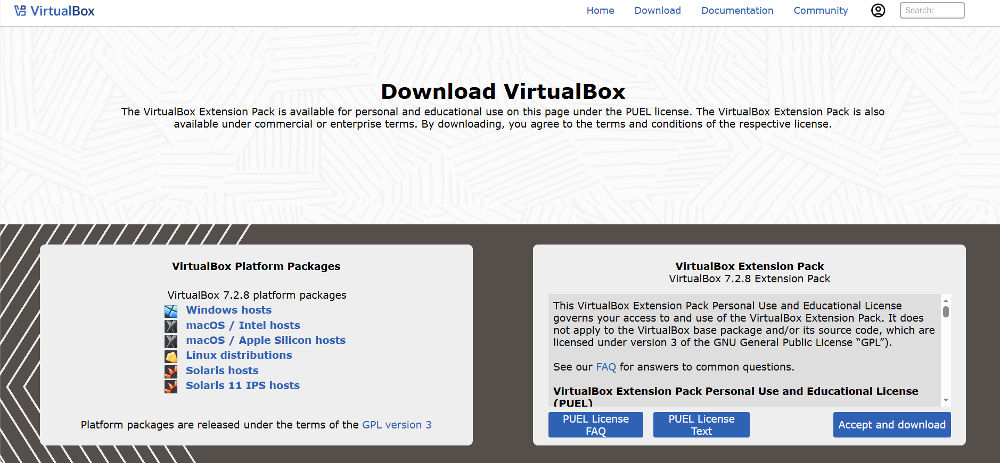
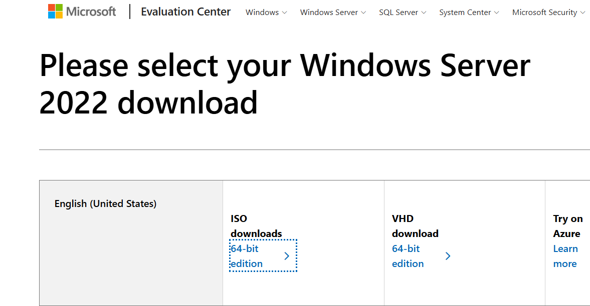
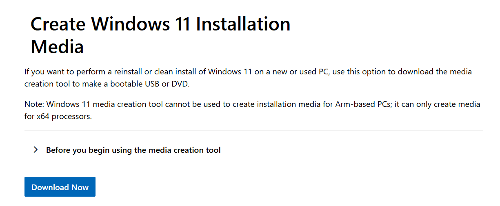
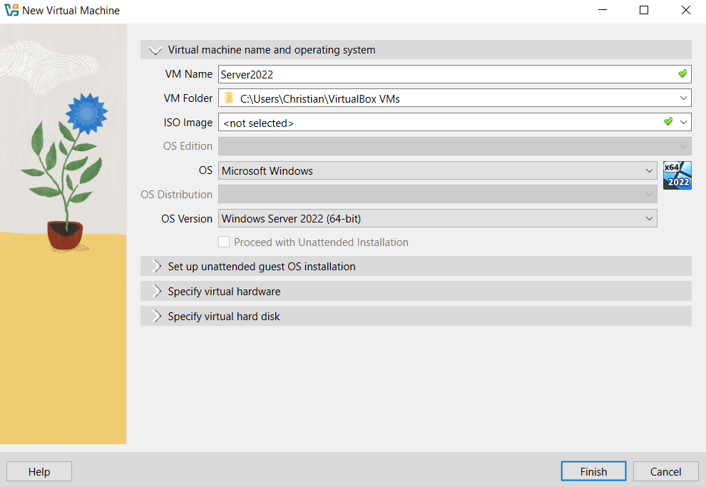
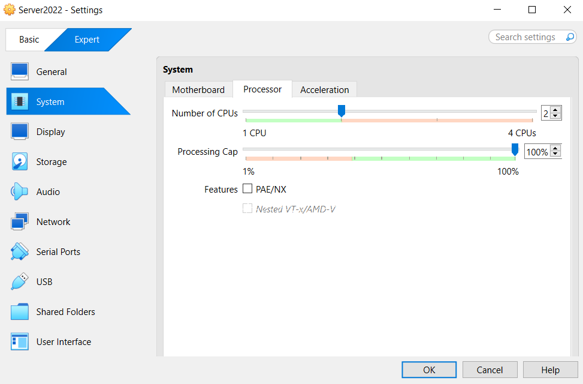
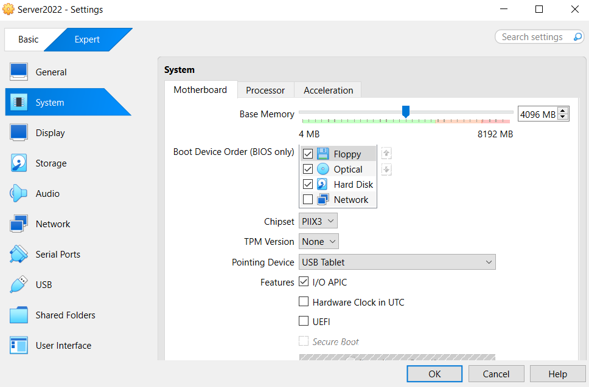

# Active Directory Home Lab - Part 1: Installing Windows Server 2022

This is Part 1 of my Active Directory home lab project. The goal of this series is to build a working AD environment from scratch: a Windows Server 2022 Domain Controller and a Windows 11 client joined to the domain, using VirtualBox on my laptop.

In this part, I set up the virtualization environment and installed Windows Server 2022.

## Lab Environment

| Component | Detail |
|-----------|--------|
| Host RAM | 8 GB |
| Host CPUs | 4 cores |
| Hypervisor | Oracle VirtualBox 7.2.8 |
| Server VM | Windows Server 2022 (Desktop Experience) |
| Client VM | Windows 11 (added in a later part) |

## Goals for Part 1

- Install Oracle VirtualBox
- Download the Server 2022 and Windows 11 ISOs
- Create the Server 2022 VM
- Install Server 2022 with Desktop Experience
- Initial configuration (admin password, time zone)

---

## 1. Installing VirtualBox

Downloaded Oracle VirtualBox 7.2.8 from the official site and installed it with default options.

---

## 2. Downloading the ISOs

**Windows Server 2022:** pulled the 64-bit evaluation ISO from the Microsoft Evaluation Center.

**Windows 11:** grabbed the multi-edition ISO so it's ready when I need it later in the walkthrough.

---

## 3. Creating the VM

Created a new VM in VirtualBox with the following config:

| Setting | Value |
|---------|-------|
| Name | Server 2022 |
| Type | Microsoft Windows |
| Version | Windows 2022 (64-bit) |
| Disk | 50 GB, VDI, dynamically allocated |
| CPU | 2 cores |
| RAM | 4096 MB (4 GB) |

**Resource reasoning:** my host only has 4 CPUs and 8 GB of RAM, so I split things roughly down the middle. 2 vCPUs and 4 GB gives Server 2022 enough room to install and update comfortably while keeping the host responsive. When the Windows 11 client gets added later, I'll drop Server 2022 to 2 GB so both VMs can run side by side without thrashing the host.

