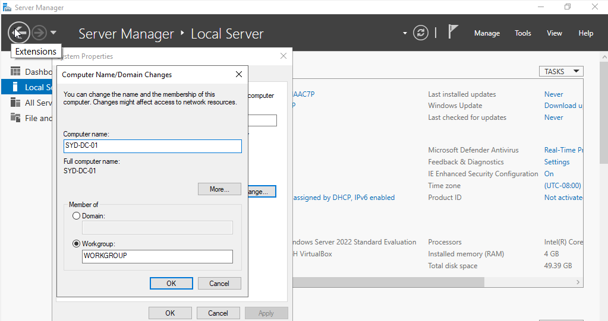
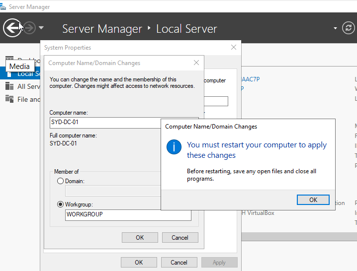
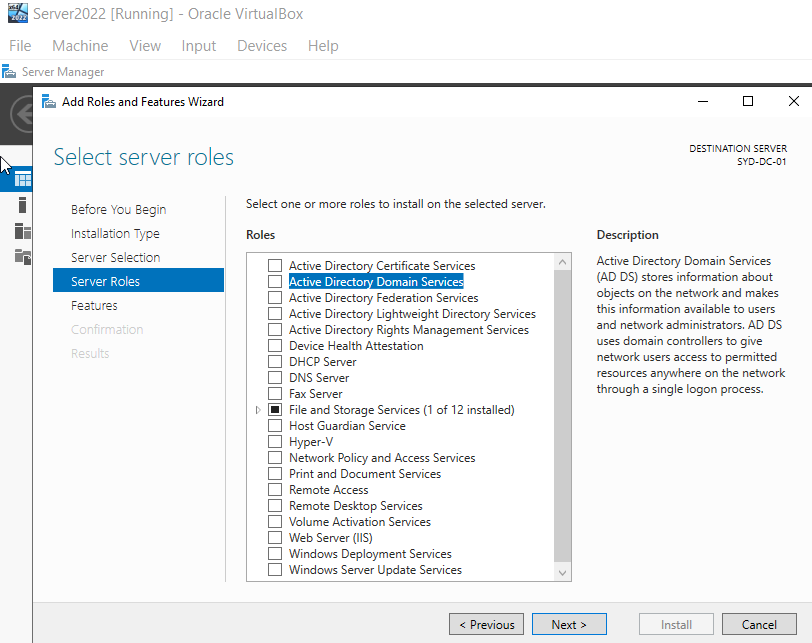
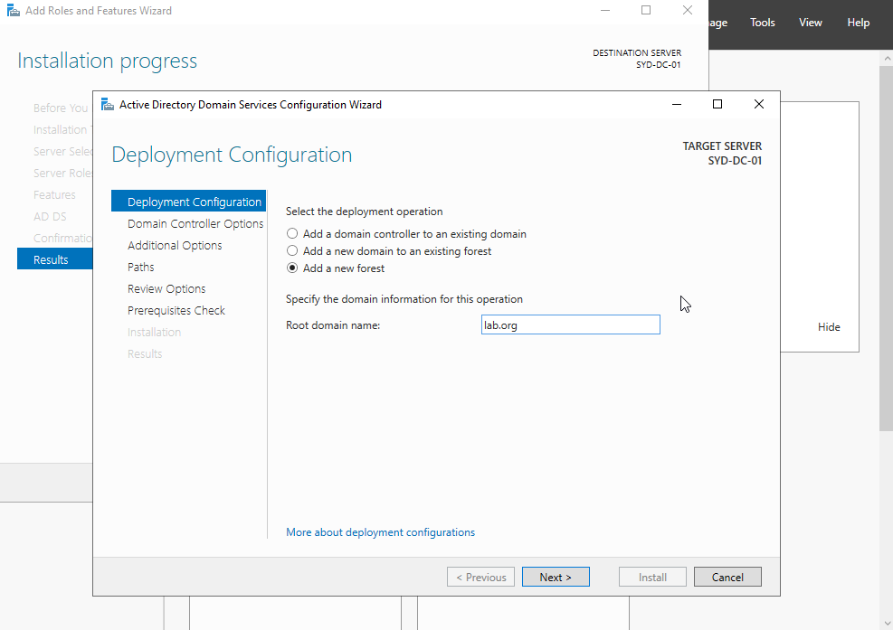
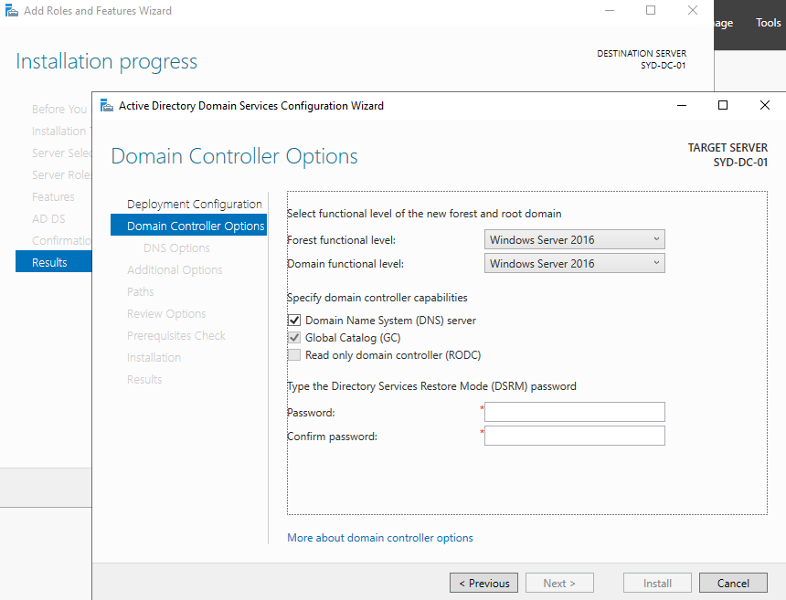
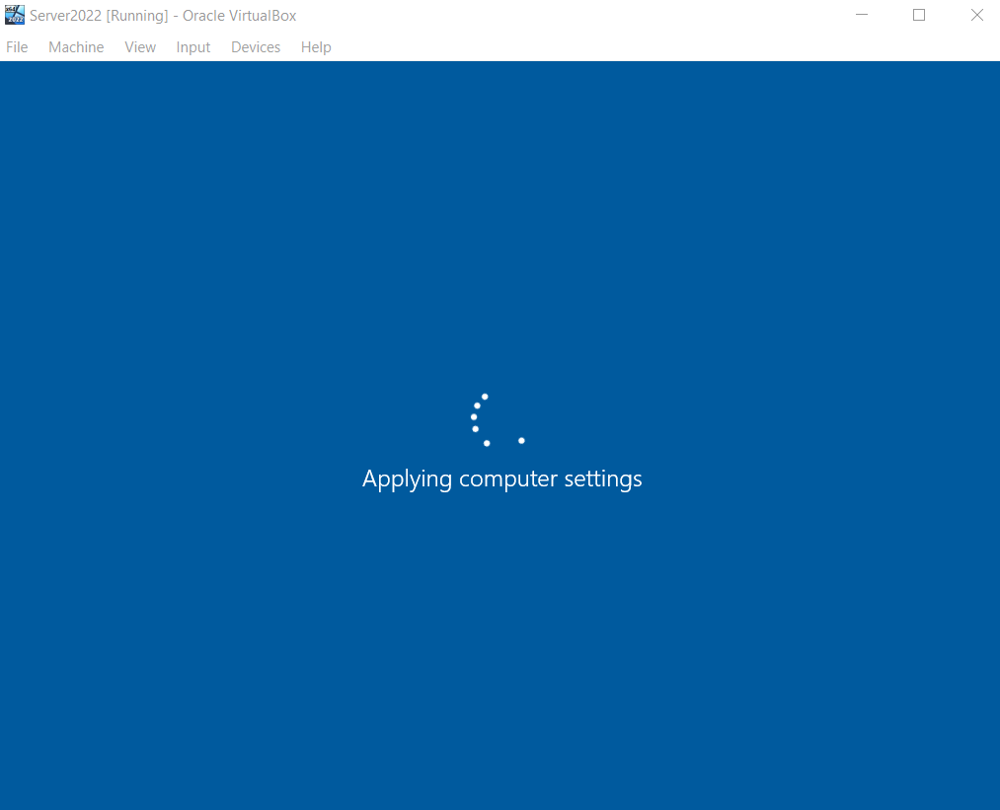
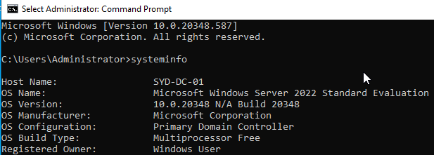

# Active Directory Home Lab - Part 2: Promoting the Server to a Domain Controller

This is Part 2 of my Active Directory home lab project. With the Server 2022 VM up and running from Part 1, the next step was turning it into an actual Domain Controller. That means renaming the server, installing the AD DS role, and promoting it as the first DC in a new forest.

## Goals for Part 2

- Rename the server to something meaningful
- Install the Active Directory Domain Services (AD DS) role
- Promote the server to a Domain Controller
- Create a new forest and domain
- Verify the install with a quick command-line check

---

## 1. Renaming the Server

By default Windows assigns a random computer name like `WIN-0907BLUE`, which is useless in a real environment. Standard practice is to name servers based on location and role, so I went with **SYD-DC-01** (location code + role + number). Sydney is the location, DC means Domain Controller, and 01 is the server number.

In Server Manager I went to **Local Server**, clicked the existing computer name, and used **Change** to rename it.

A restart was required to apply the change.

---

## 2. Installing the AD DS Role

In Server Manager, **Manage > Add Roles and Features** opens the wizard. I clicked through Next until the **Server Roles** screen, then selected **Active Directory Domain Services**. The required dependent features were added automatically when I confirmed the prompt.

The role install itself is fast. The slower part comes next: actually promoting the server.

---

## 3. Promoting to a Domain Controller

Once AD DS finished installing, the yellow notification flag in Server Manager showed **"Promote this server to a domain controller."** Clicking that link starts the AD DS Configuration wizard.

Since this is a brand new lab with no existing domain, I chose **Add a new forest** and set the root domain name to `lab.org`.

On the next screen I left the forest and domain functional levels at the default (Windows Server 2016) and set a **Directory Services Restore Mode (DSRM) password**. The DSRM password is separate from the regular admin password and is used for offline AD recovery, so it's worth picking something solid and writing it down somewhere safe.

I clicked Next through the remaining prerequisite checks until I hit **Install**.

---

## 4. The Promotion Process

Promotion takes a while because the server is configuring the AD database, DNS, replication, and SYSVOL all at once, then restarting. The VM rebooted automatically partway through.

After the reboot, the login screen showed the new domain prefix (`LAB\Administrator`), confirming the promotion worked.

---

## 5. Verifying the Installation

Once logged back in, I opened **cmd** and ran `systeminfo` to confirm everything was healthy. The output showed Host Name `SYD-DC-01`, Domain `lab.org`, and OS Name Windows Server 2022 Standard Evaluation, which is exactly what I wanted to see.

---

## Recap

- Renamed the server from the default to `SYD-DC-01`
- Installed the Active Directory Domain Services role
- Promoted the server to a Domain Controller and created a new forest (`lab.org`)
- Set the DSRM password
- Verified the install with `systeminfo`
