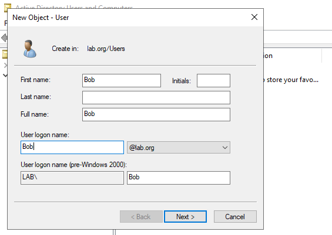
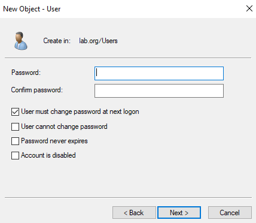
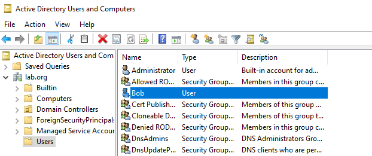
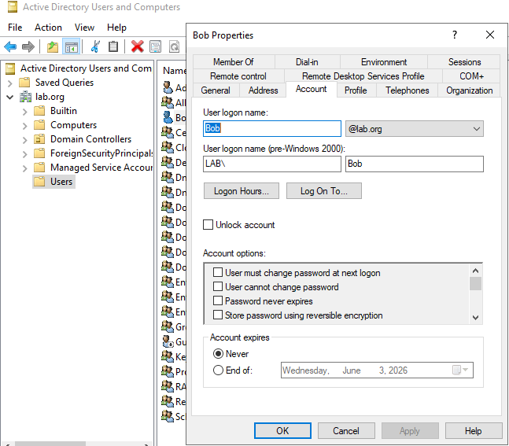
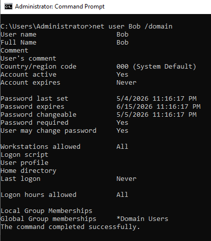

# Active Directory Home Lab - Part 3: Creating User Accounts in Active Directory

This is Part 3 of my Active Directory home lab project. Now that the Domain Controller is up and running from Part 2, it's time to actually start using Active Directory by creating user accounts.

## Goals for Part 3

- Create a user account in Active Directory Users and Computers
- Set the initial password
- Confirm the user appears in the correct OU
- Explore the common admin actions available on a user object
- Verify the account from the command line

---

## 1. Creating a User in Active Directory

Opened **Active Directory Users and Computers** from Server Manager > Tools, expanded the `lab.org` domain, right-clicked the **Users** container, and chose **New > User**.

For the first account I created **Bob**. Standard practice in a real environment is to fill in as much detail as possible (department, title, manager, address, phone), because help desk tickets often start with someone searching the user in AD to figure out who they are and what they have access to.

---

## 2. Setting the Initial Password

I gave the account a temporary password and ticked **User must change password at next logon**, which is the normal setup for a new hire so they pick their own password on first login.

---

## 3. Confirming the User Appears

After clicking Finish, Bob shows up in the Users container alongside the built-in accounts. 

---

## 4. Exploring the User Object

Once a user is created, double-clicking them opens up a tabbed properties window with most of what a help desk technician deals with day to day. The key tabs are:

- **General / Address / Telephones / Organisation tabs** for contact info, job title, department, and manager. This is the data the help desk relies on for context.
- **Account tab** has the username, account expiry, and the **Logon Hours** button. Logon Hours lets you restrict when an account can sign in (for example, only Monday to Friday, 8am to 6pm). Useful for contractors or shift workers, and also for testing security controls.

A few right-click actions worth knowing:

- **Reset Password** to issue a new temporary password (common help desk task).
- **Disable Account** marks the account with a down-arrow icon so it can't sign in, without deleting it. Used when someone leaves or is on extended leave. Right-click again to re-enable.
- **Unlock Account** (inside the Account tab) clears a lockout caused by too many bad password attempts.

---

## 5. Verifying from the Command Line

After creating the account, I jumped to cmd and ran:
net user Bob /domain

This pulls the account details straight out of AD: full name, when the password was last set, when it expires, account active status, and which groups the user belongs to. Handy to verify the account exists and is configured how you expect without opening the GUI.

---

## Recap

- Created an AD user account (Bob) in `lab.org`
- Set a temporary password with the "must change at next logon" flag
- Confirmed the user appears in the Users container
- Walked through the user properties tabs and common admin actions (reset password, disable, unlock, logon hours)
- Verified the account from cmd with `net user /domain`

