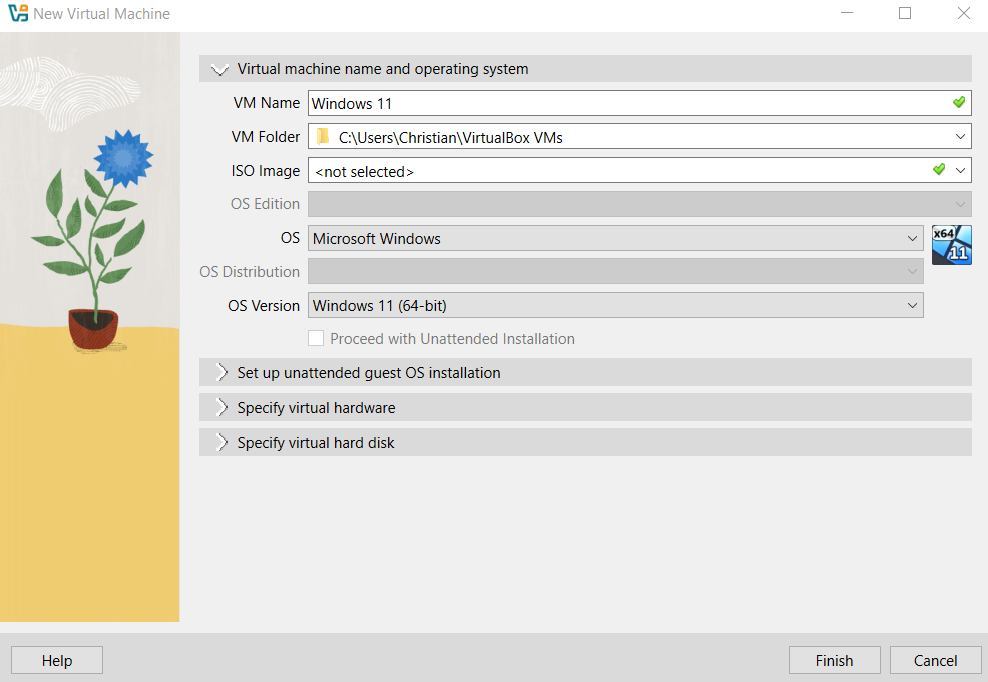

# Active Directory Home Lab - Part 4: Joining a Windows 11 Client to the Domain

This is Part 4 of my Active Directory home lab project. With the Domain Controller built and a couple of users created, the next step is to actually have a workstation talk to the DC. I built a Windows 11 client VM, configured the network so the two VMs could see each other, joined the client to the domain, and logged in as one of my AD users.

## Goals for Part 4

- Build a Windows 11 client VM
- Configure VirtualBox networking so the client and server can communicate
- Set static IPs and point the client's DNS at the Domain Controller
- Rename the client and join it to `lab.org`
- Log in as a domain user from the client
- RDP into the Domain Controller from the client

---

## 1. Building the Windows 11 VM

In VirtualBox I created a new VM:

| Setting | Value |
|---------|-------|
| Name | Windows 11 |
| Type | Microsoft Windows |
| Version | Windows 11 (64-bit) |
| Disk | 80 GB, VDI, dynamically allocated |
| CPU | 2 cores |
| RAM | 4096 MB (4 GB) |

**Important:** for the Windows 11 install, I picked **Windows 11 Pro**. Windows 11 Home cannot join a domain, so Pro or Enterprise is required for this lab.

I dropped the RAM on the Server 2022 VM down to 2 GB before starting both VMs at the same time, since my host only has 8 GB total.

---
