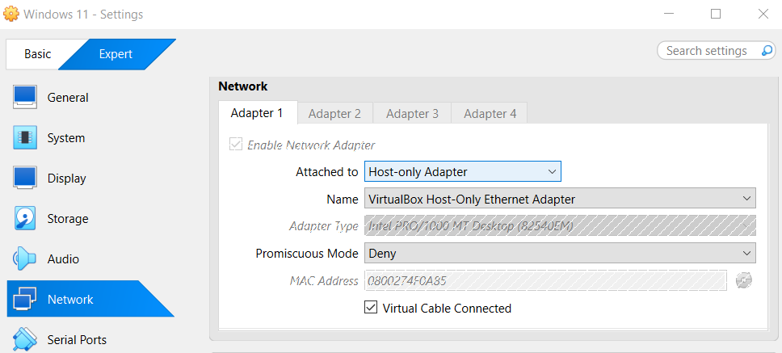
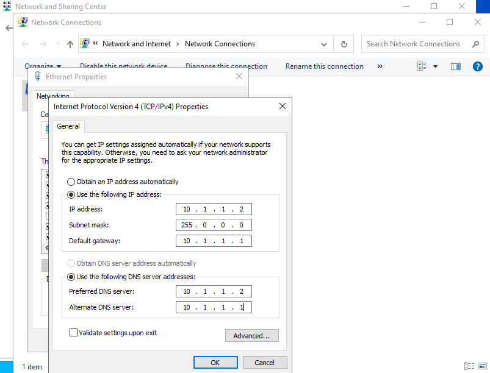
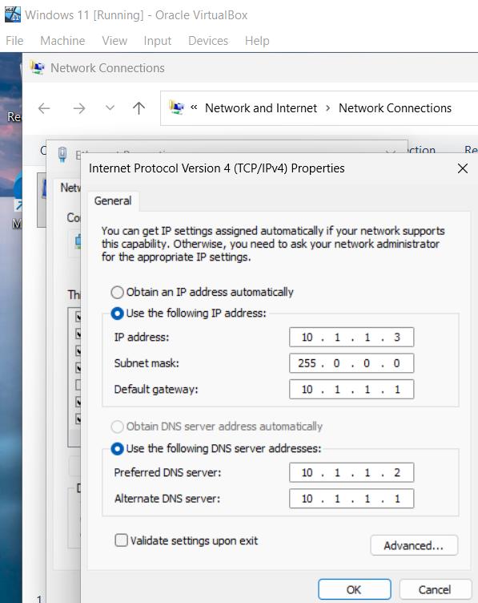
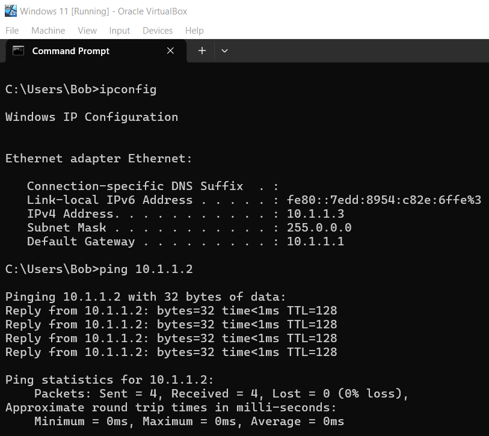
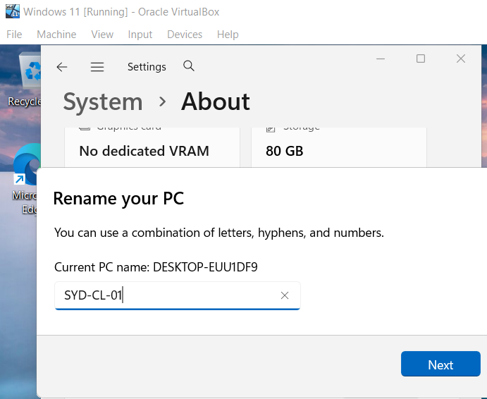
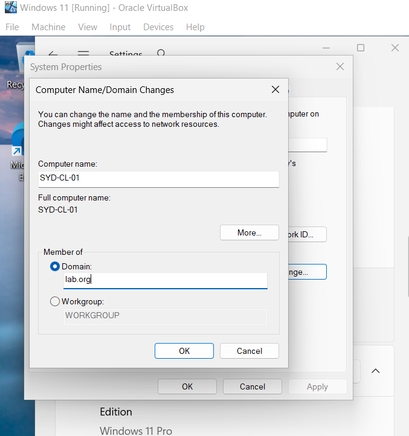
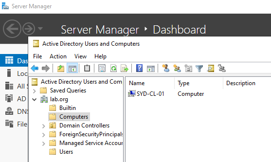
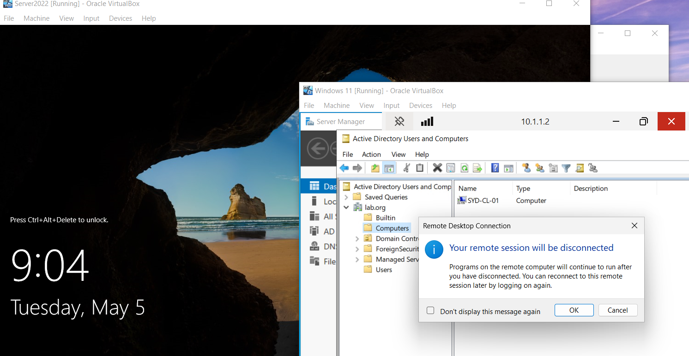

# Active Directory Home Lab - Part 4: Joining a Windows 11 Client to the Domain

This is Part 4 of my Active Directory home lab project. With the Domain Controller built and a couple of users created, the next step is to actually have a workstation talk to the DC. I built a Windows 11 client VM, configured the network so the two VMs could see each other, joined the client to the domain, and finished by RDP'ing back into the DC from the client.

## Goals for Part 4

- Build a Windows 11 client VM
- Configure VirtualBox networking so the client and server can communicate
- Set static IPs and point the client's DNS at the Domain Controller
- Rename the client and join it to `lab.org`
- Confirm the client appears in Active Directory
- Enable Remote Desktop and connect to the DC from the client

---

## 1. Building the Windows 11 VM

In VirtualBox I created a new VM:

| Setting | Value |
|---------|-------|
| Name | Windows 11 |
| Type | Microsoft Windows |
| Version | Windows 11 (64-bit) |
| Disk | 80 GB, VDI, dynamically allocated |
| CPU | 2 cores |
| RAM | 4096 MB (4 GB) |

**Important:** I picked **Windows 11 Pro** for the install. Windows 11 Home cannot join a domain, so Pro or Enterprise is required for this lab.

I dropped the RAM on the Server 2022 VM down to 2 GB before starting both VMs at the same time, since my host only has 8 GB total.

---

## 2. Network Configuration

To let the two VMs talk to each other on a private network, I switched both VMs to use a **Host-only Adapter**.

In VirtualBox: **VM Settings > Network > Adapter 1**, then changed **Attached to** from NAT to **Host-only Adapter**, using the default `VirtualBox Host-Only Ethernet Adapter`.

I did this on both the Server 2022 VM and the Windows 11 VM so they end up on the same isolated subnet.

### Static IP plan

To keep things predictable, I assigned static IPs from the host-only network's range:

| Machine | IP Address | Subnet Mask | Default Gateway | DNS |
|---------|-----------|-------------|-----------------|-----|
| SYD-DC-01 (Server) | 10.1.1.2 | 255.0.0.0 | 10.1.1.1 | 10.1.1.2 / 10.1.1.1 |
| SYD-CL-01 (Client) | 10.1.1.3 | 255.0.0.0 | 10.1.1.1 | 10.1.1.2 / 10.1.1.1 |

The key bit is that the **client's preferred DNS points at the Domain Controller's IP** (`10.1.1.2`). Without this, the client cannot resolve the domain name when joining, and the join will fail. AD relies heavily on DNS.

I set the IPs through **Control Panel > Network and Sharing Center > Change adapter settings > IPv4 Properties** on each VM.

**Server (SYD-DC-01):**

**Client (SYD-CL-01):**

### Verifying connectivity

From the Windows 11 client, opened cmd and ran:
ipconfig
ping 10.1.1.2

`ipconfig` confirmed the client had `10.1.1.3`, and the ping to the server got 4 replies with 0% loss. That confirms the two VMs can see each other on the host-only network before even trying the domain join.

---

## 3. Renaming the Client

Same idea as renaming the server in Part 2: the default Windows 11 hostname (`DESKTOP-EUU1DF9` in this case) is junk, so I renamed it to **SYD-CL-01** (Sydney + Client + 01).

**Settings > System > About > Rename this PC**, typed the new name, restarted.

---

## 4. Joining the Domain

Once the client was back up after the rename, I opened **System Properties > Computer Name > Change**.

Selected **Domain** and typed `lab.org`.

A credential prompt appeared asking for an account that has permission to join machines to the domain. I entered the **Administrator** account from the Domain Controller along with its password.

A restart was required to finish joining.

### Confirming on the server

Back on **SYD-DC-01**, I opened Active Directory Users and Computers and looked at the **Computers** container. The client `SYD-CL-01` had appeared in there automatically, which is the proof the join worked from the server side.

---

## 5. RDP Into the Domain Controller

From the Windows 11 client, I opened **Remote Desktop Connection** and connected to the DC at `10.1.1.2` using the domain administrator credentials. The DC desktop loaded over RDP, and I could open Active Directory Users and Computers from inside the RDP session.

This is a small taste of what real help desk and sysadmin work looks like: jumping between machines remotely instead of bouncing between physical consoles.

---

## Recap

- Built a Windows 11 Pro VM with 2 vCPU and 4 GB RAM
- Switched both VMs to Host-only Adapter so they share an isolated network
- Set static IPs (server `10.1.1.2`, client `10.1.1.3`) and pointed the client's DNS at the DC
- Renamed the client to `SYD-CL-01`
- Joined `SYD-CL-01` to the `lab.org` domain
- Confirmed the client appeared in AD Users and Computers under the Computers container
- Enabled Remote Desktop on the DC and connected to it from the Windows 11 client
