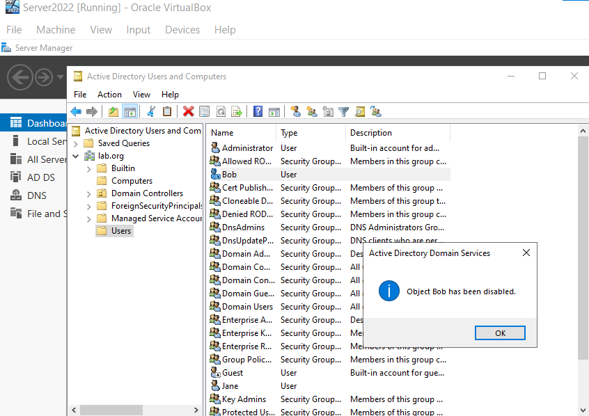
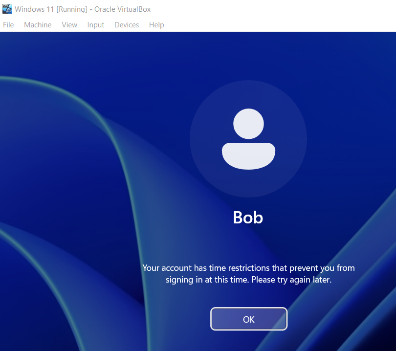
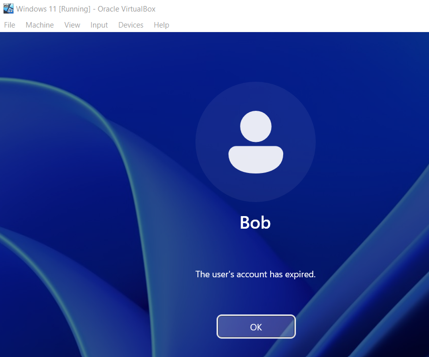
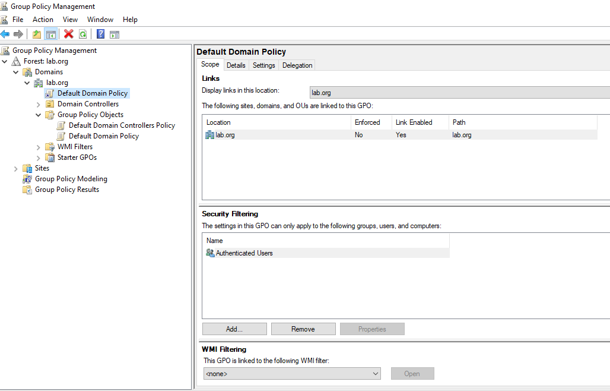
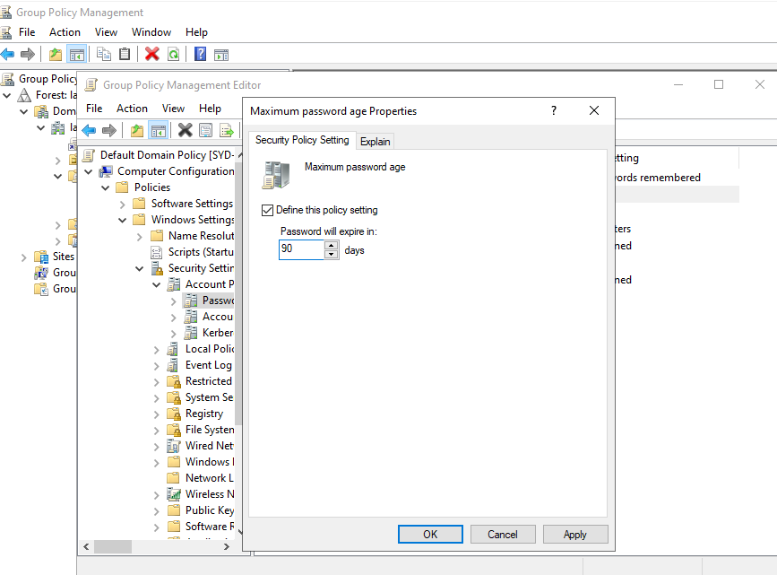
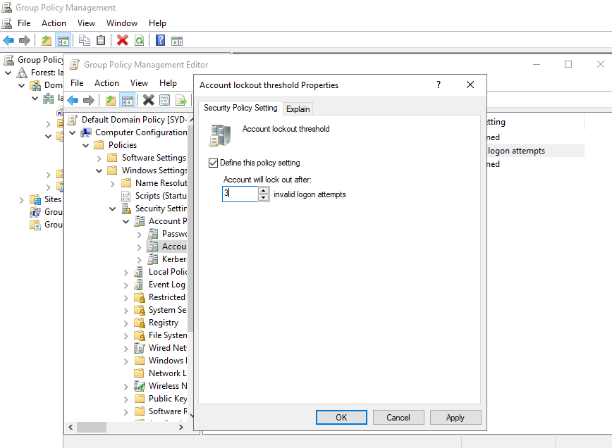
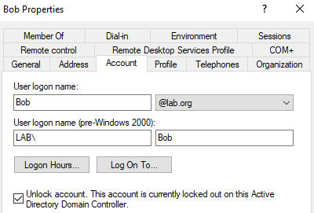

# Active Directory Home Lab - Part 5: Group Policy and Replicating Help Desk Issues

This is Part 5 of my Active Directory home lab project. The previous parts focused on building the environment. This one is about actually using it the way a help desk technician would: simulating common user account problems, fixing them, and then setting up a Group Policy to enforce password and lockout rules across the domain.

## Goals for Part 5

- Simulate common help desk scenarios (disabled, restricted, expired accounts)
- Open Group Policy Management on the Domain Controller
- Configure a password policy (max age, min length)
- Configure an account lockout policy
- Trigger a lockout and clear it through Active Directory

---

## 1. Simulating a Disabled User

The first scenario: Bob has left the company, so HR raises a ticket asking the help desk to disable his account.

On the Domain Controller, opened **Active Directory Users and Computers**, found Bob in the Users container, right-clicked his account, and chose **Disable Account**. The icon updated to show a small down-arrow, indicating the account is disabled.

A disabled account can't sign in to the domain at all. This is the standard offboarding action: disable rather than delete, so the account history and group memberships are preserved if needed for audits.

---

## 2. Other Account States to Know

Two more account states that come up regularly in help desk tickets.

### Logon hours restriction

The **Logon Hours** button on the Account tab lets you restrict when a user is allowed to sign in. I blocked all hours and tried to log Bob in. The error message reads:

> "Your account has time restrictions that prevent you from signing in at this time. Please try again later."

Useful to know on sight. When a user calls in saying they can't log in "after hours," this is usually why.

### Expired account

The **Account expires** option on the same tab is used for contractors and temporary staff. Setting it to a date in the past produces:

> "Your account has expired. Please contact your system administrator."

Common ticket: a contractor's extension didn't get processed in time. Fix is to extend the expiry date or set it to **Never**.

---

## 3. Opening Group Policy Management

Now the Group Policy work. From Server Manager: **Tools > Group Policy Management**.

Expanded **Forest > Domains > lab.org**, where the **Default Domain Policy** lives. This is the GPO that applies to every object in the domain by default, which makes it the right place for org-wide password and lockout rules.

Right-clicked **Default Domain Policy** and chose **Edit** to open the Group Policy Management Editor.

Navigated to: **Computer Configuration > Policies > Windows Settings > Security Settings > Account Policies**.

This branch has two sub-folders worth knowing:

- **Password Policy** controls password complexity, length, age, and history.
- **Account Lockout Policy** controls how many bad passwords trigger a lockout and how long the lockout lasts.

---

## 4. Configuring the Password Policy

Inside **Password Policy**, I set:

| Setting | Value | Reason |
|---------|-------|--------|
| Maximum password age | 90 days | Balance between security and user pain. 30 days is too aggressive for a lab, 120+ is too lax |
| Minimum password age | 1 day | Stops users immediately cycling through their password history to keep the same password |
| Minimum password length | 12 characters | Aligns with current audit recommendations (NIST and ACSC both push for longer minimums) |
| Password history | 24 passwords | Default, prevents reuse of recent passwords |
| Complexity requirements | Enabled | Default, requires upper, lower, digit, symbol |

Real-world password policy is usually dictated by the company's compliance requirements (ISO 27001, Essential Eight, etc.). For the lab, these are sensible defaults.

---

## 5. Configuring the Account Lockout Policy

Inside **Account Lockout Policy**, I set:

| Setting | Value | Reason |
|---------|-------|--------|
| Account lockout threshold | 3 invalid attempts | Aggressive but good for catching brute force attempts |
| Account lockout duration | 360 minutes | Long enough to discourage brute force, short enough that legitimate users aren't locked out forever. Some orgs set this to 0 (admin must unlock) |
| Reset account lockout counter after | 30 minutes | Standard default |

---

## 6. Triggering and Clearing a Lockout

Last test: deliberately locking Bob's account by typing the wrong password 3 times on the client. After the third attempt, Windows responded with:

> "The referenced account is currently locked out and may not be logged on to."

This is the classic help desk ticket. From the Domain Controller, the fix is two clicks:

1. Open **Active Directory Users and Computers**
2. Right-click the user > **Properties** > **Account** tab > tick **Unlock account** > OK

Bob can sign in immediately after that.

---

## Recap

- Disabled a user account to simulate offboarding
- Saw the error messages for logon hours restrictions and expired accounts
- Opened Group Policy Management and edited the Default Domain Policy
- Set a password policy: 90 day max age, 12 character minimum
- Set an account lockout policy: 3 attempts, 360 minute lockout
- Triggered a lockout and unlocked the account through ADUC
