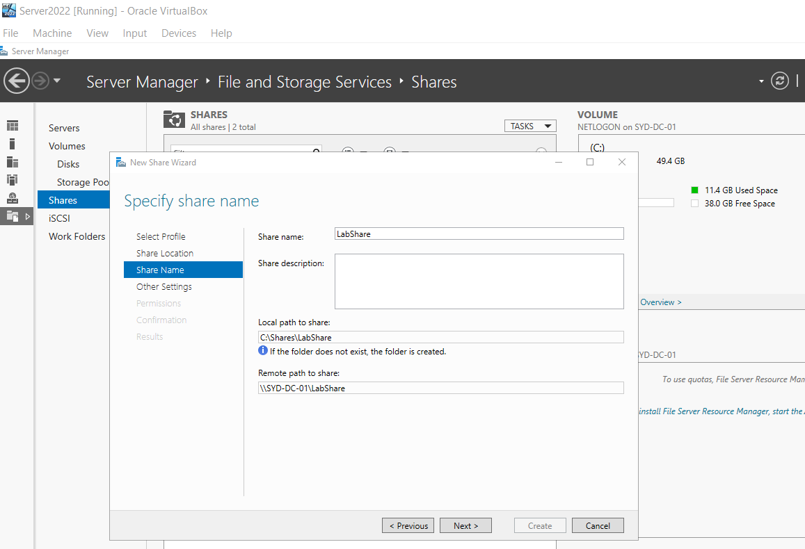
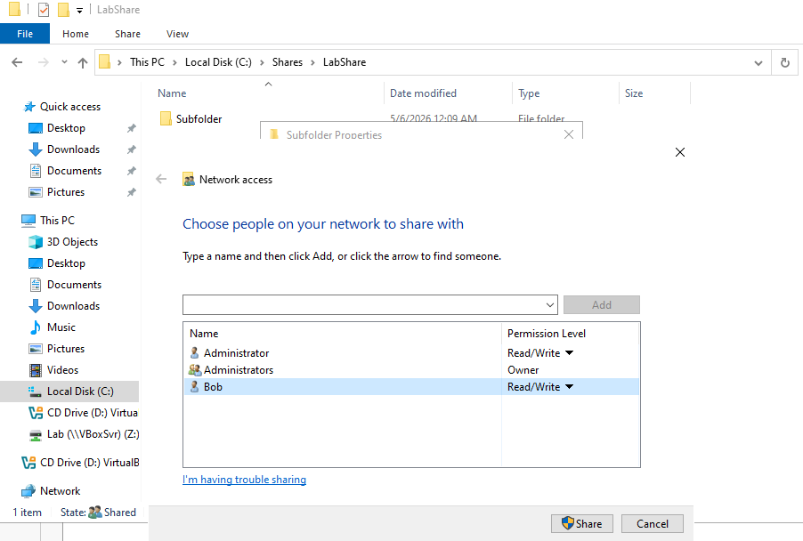
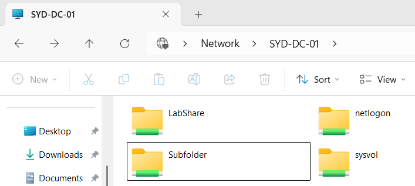
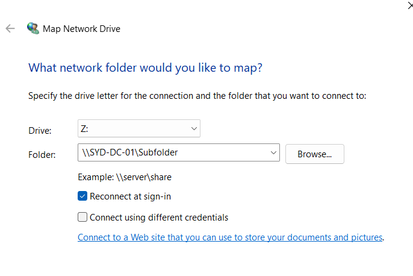
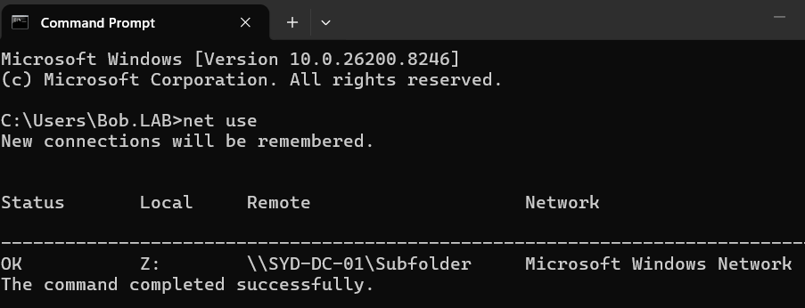
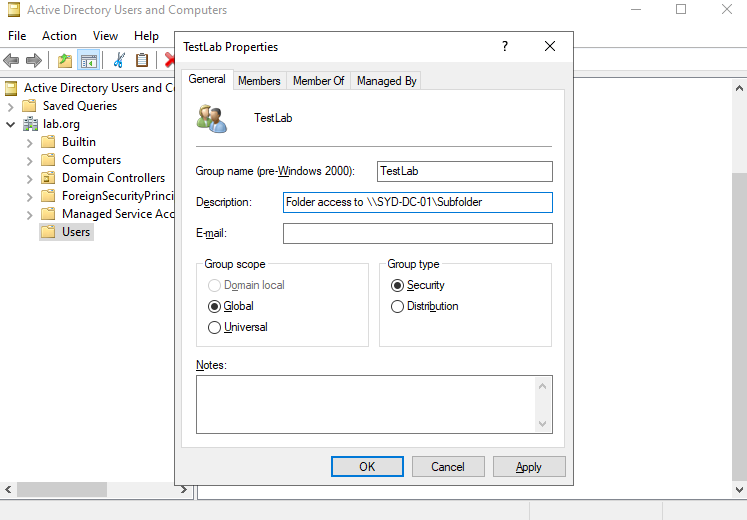
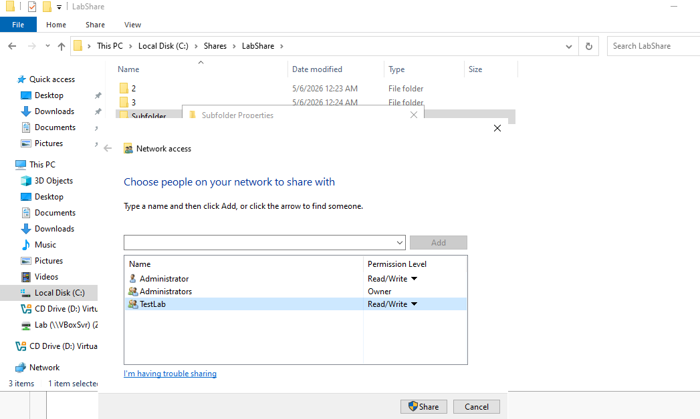
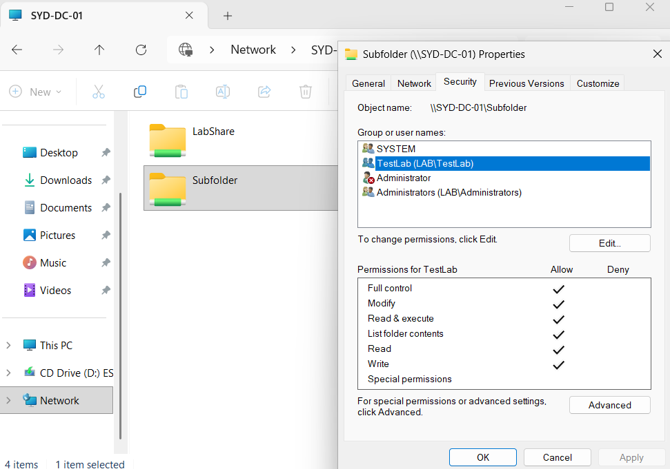

# Active Directory Home Lab - Part 6: Shared Folders and NTFS Permissions

This is Part 6 of my Active Directory home lab project. Up to now the lab has been about identity and policy. This part shifts to **file sharing**

The goal: create a shared folder, give a specific user access to a sub-folder only, log in as that user to test it, map it as a network drive, and then redo it the proper way using a security group.

## Goals for Part 6

- Create a shared folder on the Domain Controller using Server Manager
- Grant a single user access to a sub-folder only (not the parent)
- Test access by logging in as the user
- Map the share as a network drive
- Redo the permissions properly using an Active Directory security group

---

## 1. Creating the Shared Folder

On the Domain Controller, opened **Server Manager > File and Storage Services > Shares**, right-clicked the shares pane, and chose **New Share**.

Used the **SMB Share - Quick** profile, selected the C: drive as the location, and named the share **LabShare**. The wizard automatically creates the folder at `C:\Shares\LabShare` and exposes it on the network as `\\SYD-DC-01\LabShare`.

---

## 2. Why Sub-Folder Permissions Matter

I deliberately did not give Bob access to the entire `LabShare` folder. In real environments, granting a user access to the top of a share gives them access to everything underneath it, which usually isn't what you want.

The right approach is to share the parent folder broadly (or just to admins) and then **assign permissions on specific sub-folders** based on team or role.

Inside `LabShare` I created a sub-folder called **Subfolder**. That's the folder Bob will be granted access to.

C:\Shares\LabShare
└── Subfolder\        <-- Bob gets access here only

---

## 3. Setting Permissions the Quick Way (Direct User Add)

Right-clicked the **Subfolder** folder and went to **Properties > Sharing > Share**, then added **Bob** with **Read/Write** permissions. The Administrator account stays in the list as the owner so the share isn't accidentally locked away from admins.

---

## 4. Testing as the User

Logged into the Windows 11 client as **Bob**. Browsing to `\\SYD-DC-01` from File Explorer showed the available shares, and Bob could open **Subfolder** because of the permissions I just granted.

Trying to open `LabShare` directly was denied (no permissions on the parent), which is exactly the principle of least privilege in action: users only get access to what they need, nothing more.

---

## 5. Mapping the Share as a Network Drive

Browsing by UNC path (`\\server\share`) works but is inconvenient for end users. The standard help desk fix is to map the share as a drive letter so it shows up in This PC like any other drive.

Right-clicked **This PC > Show more options > Map network drive**, picked drive letter **Z:**, and pasted in `\\SYD-DC-01\Subfolder`. Ticked **Reconnect at sign-in** so the mapping persists across reboots.

Verified it from cmd with:
net use

Output showed `Z:` mapped to `\\SYD-DC-01\Subfolder`, confirming the mapping is active.

In a real environment these mappings are usually pushed automatically via Group Policy Preferences (Drive Maps) so users don't have to do it manually, but knowing how to do it by hand is useful for help desk work.

---

## 6. The Proper Way: Security Groups

Adding individual users directly to folders works, but it doesn't scale. Imagine doing it for 50 users across 30 folders. The standard practice is to use **Active Directory Security Groups** instead.

Opened **Active Directory Users and Computers** and created a new group:

- **Group name:** `TestLab`
- **Group scope:** Global
- **Group type:** Security
- **Description:** "Folder access to \\\\SYD-DC-01\\Subfolder"

The description field is important. In a real environment you'll have dozens of groups, and a clear description tells you exactly what the group does and where it grants access.

Added Bob as a member of the group, then went to the **Subfolder** Security tab and added `TestLab` with the same Modify-level rights. Confirmed `TestLab (LAB\TestLab)` appears in the permission list with the right boxes ticked.

Removed Bob's direct user permission from the folder so access is now coming purely through the group.

Logged back in as Bob to confirm he still has access through the group membership.

---

## Recap

- Created a shared folder (`LabShare`) on the DC using Server Manager
- Created a sub-folder (`Subfolder`) and locked permissions to that level instead of the parent
- Granted Bob direct Read/Write access first, then logged in as Bob to confirm it worked
- Mapped the share as a network drive (Z:) and verified with `net use`
- Recreated the access using a security group (`TestLab`), which is the way it's actually done in production
