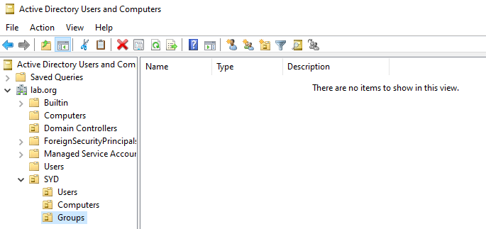
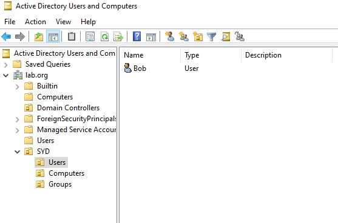
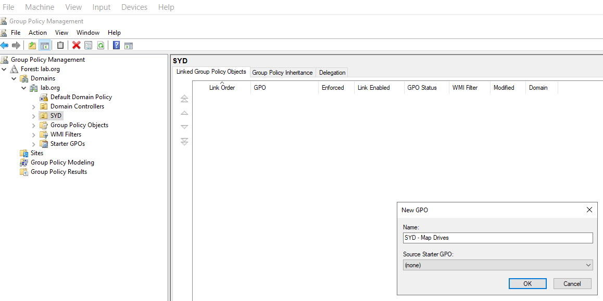
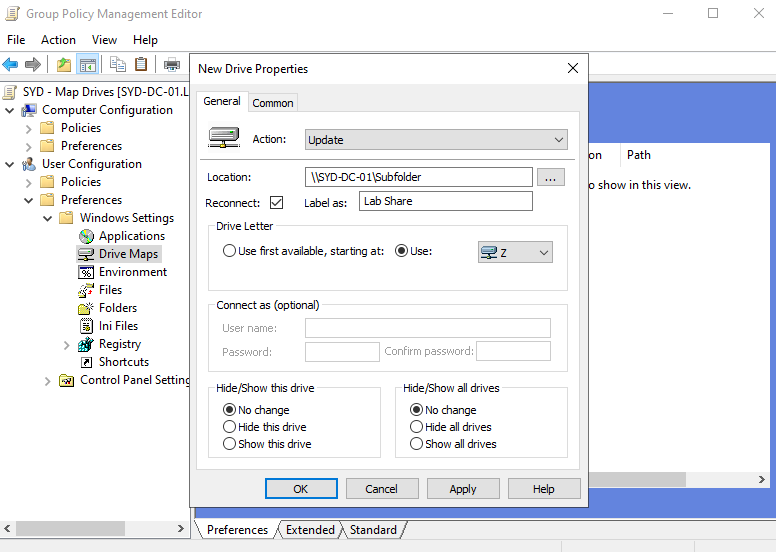
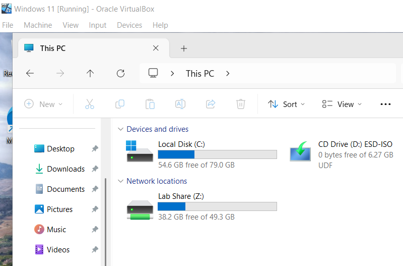

Active Directory Home Lab - Part 7: Organisational Units and Targeted Group Policy

This is Part 7 of my Active Directory home lab project. Up until now all my users have been sitting in the default Users container, which works but isn't how real environments are structured. This part fixes that by building an Organisational Unit (OU) structure and using it to apply a Group Policy that only affects a specific group of users, not the entire domain.

## Goals for Part 7

- Build an OU structure that mirrors a real organisation
- Move users into the right OUs
- Create a new GPO and link it to a specific OU
- Configure the GPO to map a network drive automatically at sign-in
- Verify the policy only applies to users in that OU

---

## 1. Why OUs Matter

The default Users container is fine for a handful of accounts but breaks down quickly. OUs give you two things the Users container can't:

- **Delegation** - you can grant rights over a specific OU (e.g. let the help desk team reset passwords for the Sydney users only)
- **Targeted Group Policy** - GPOs link to OUs, so different teams can have different settings

The Default Domain Policy from Part 5 applies to **everyone**. That's right for password rules. But if I want a setting that only applies to the Sydney IT team, I need an OU.

---

## 2. Building the OU Structure

In **Active Directory Users and Computers**, right-clicked the `lab.org` domain and chose **New > Organizational Unit**. Built this structure:
lab.org
└── SYD
├── Users
├── Computers
└── Groups

Started with just Sydney for the lab. In a real environment you'd add MEL, BNE, etc. as the org grows.

---

## 3. Moving Users into the OUs

Right-clicked Bob in the Users container, chose **Move**, and selected `SYD > Users`. He now lives at `lab.org/SYD/Users/Bob` instead of `lab.org/Users/Bob`.

Did the same with the `TestLab` security group from Part 6, moving it into `SYD/Groups`.

---

## 4. Creating a Targeted GPO

Now the useful part: a GPO that only affects users in `SYD/Users`.

Opened **Group Policy Management** from Server Manager > Tools, right-clicked the **SYD/Users** OU, and chose **Create a GPO in this domain, and Link it here**. Named it **SYD - Map Drives**.

Right-clicked the new GPO and chose **Edit** to open the Group Policy Management Editor.

---

## 5. Configuring the Drive Mapping

Navigated to: **User Configuration > Preferences > Windows Settings > Drive Maps**.

Right-clicked, **New > Mapped Drive**, and configured:

| Setting | Value |
|---------|-------|
| Action | Update |
| Location | `\\SYD-DC-01\Subfolder` |
| Reconnect | Ticked |
| Label as | Lab Share |
| Drive Letter | Use - Z |

This automatically maps the network drive from Part 6 every time a user in the SYD OU signs in. No more asking users to manually map drives.

## 6. Forcing and Verifying

By default GPOs apply at the next login, but I wanted to test it immediately. On the Windows 11 client, opened cmd as admin and ran:
gpupdate /force

Logged out and back in as Bob. Opened File Explorer and the **Z: drive labelled "Lab Share"** was already mapped automatically.

This is the real value of OUs and targeted GPOs working together. Move a user into `SYD/Users` and they automatically get the drive. Remove them from the OU and the drive disappears at next login.

---

## Recap

- Built an OU structure (`SYD/Users`, `SYD/Computers`, `SYD/Groups`) to mirror a real org
- Moved Bob and the TestLab group into the new OUs
- Created a new GPO linked specifically to `SYD/Users`
- Configured the GPO to auto-map the file share from Part 6 as drive Z:
- Verified the mapping happens automatically at sign-in

