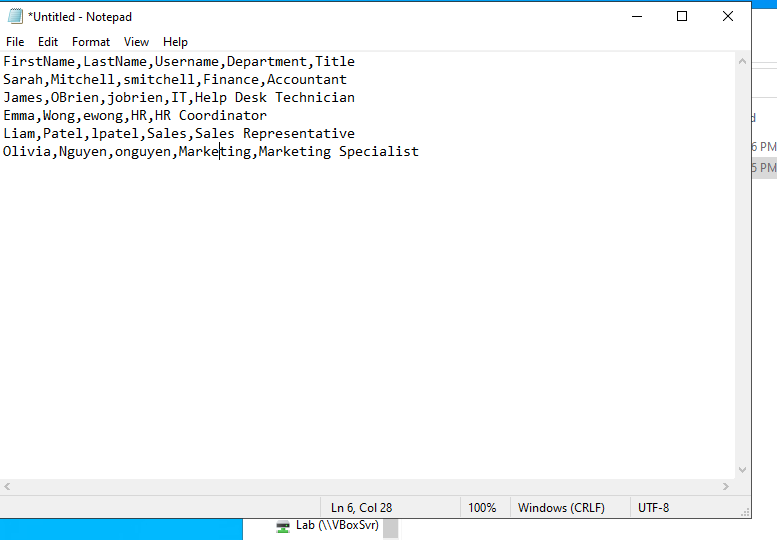
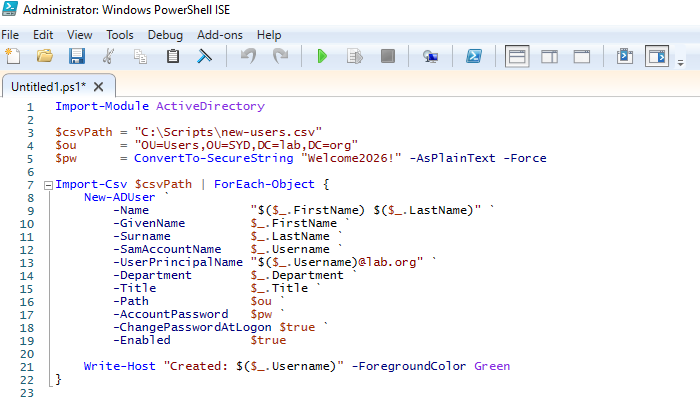
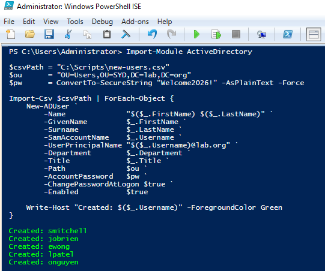
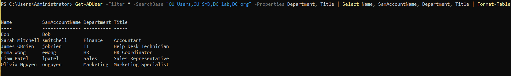
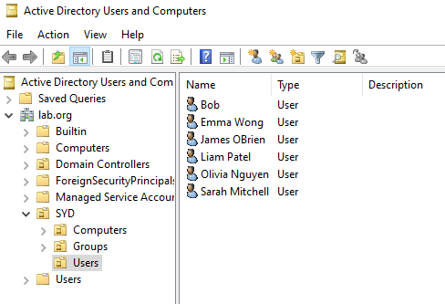

# Active Directory Home Lab - Part 8: Bulk Creating Users with PowerShell

This is Part 8 of my Active Directory home lab project. So far I've created users one at a time through ADUC, which doesn't scale. This part covers the standard way to handle bulk user creation: a CSV file plus a PowerShell script.

## Goals for Part 8

- Build a CSV with multiple new users
- Use PowerShell to import the CSV and create the accounts
- Drop the new users into the `SYD/Users` OU from Part 7
- Verify the result

---

## 1. The CSV File

Created `C:\Scripts\new-users.csv` with five new staff accounts. Each row becomes one user, and the header names line up with the parameters used in the script.

---

## 2. The PowerShell Script

Saved as `C:\Scripts\bulk-create-users.ps1`. AI-assisted, reviewed and tested before running.

What each block does:
- **Import-Module** loads the AD cmdlets
- **Import-Csv** reads the file into objects
- **ForEach-Object** loops through each row
- **New-ADUser** creates the account with the properties from the CSV

---

## 3. Running the Script

Opened PowerShell ISE as Administrator and pressed F5. All five users created in seconds with green confirmation lines.

---

## 4. Verification

`Get-ADUser` only returns a small set of default properties, so I had to use `-Properties` to pull the Department field explicitly:

Output confirmed all five new users are in the right OU with their departments populated. Bob (from Part 3) shows up too with no Department since he was created manually before this script existed.

Spot-checked in ADUC as well - all five new users sit alongside Bob in `SYD/Users`.

---

## Recap

- Built a CSV with five new accounts
- Used an AI-assisted PowerShell script to bulk-create the users
- Reviewed the script line by line before running, then verified results with `Get-ADUser`
- All five users landed in the `SYD/Users` OU with Department populated

## Wrapping Up the Lab

That's the lab. Across eight parts I've built a working AD environment from scratch, joined a client, replicated common help desk scenarios, set up Group Policy, configured file shares with proper permissions, structured an OU layout, and automated user creation with PowerShell.
